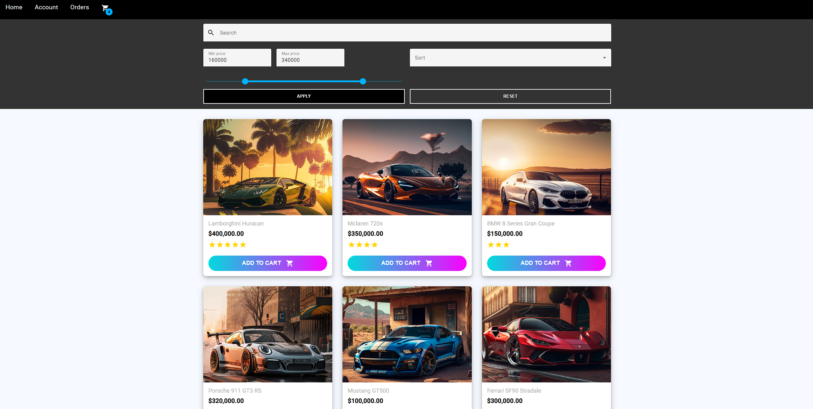

# E-commerce Website

In this project, I've built an E-commerce full-stack web app using Angular for the frontend and Nest.js for the backend. The app allows users to buy their favorite sports cars :)


## Tech stack

Angular, Nest.js, Typescript, TypeORM, MySQL
## Screenshots


<br><br>


## Database schema


## Run Locally

Clone the project

```bash
  git clone https://github.com/piotrv1001/Shop.git
```

Go to the project directory

```bash
  cd Shop
```

In the first terminal, go to the backend folder

```bash
  cd backend
```

Start the server

```bash
  npm run start
```

In the second terminal, go to the frontend folder

```bash
  cd frontend
```

Start the application

```bash
  ng serve --open
```

<i>Note: This requires to have a local MySQL database running on port 3306.</i>

## Features

- JWT Authentication
- Browsing products, filtering by price and rating
- Adding products to the cart
- Full checkout process
- Order history

